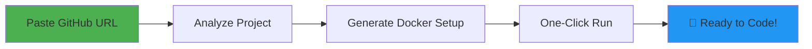

<div align="center">

# 🚀 Onboarder

### Automated Developer Environment Setup Tool

**Transform hours of onboarding into minutes with intelligent automation**

[](https://choosealicense.com/licenses/mit/)
[](https://nodejs.org/)
[](https://www.mongodb.com/)
[](https://reactjs.org/)

[Features](#-key-features) • [Quick Start](#-quick-start) • [API Docs](#-api-reference) • [Roadmap](#-development-roadmap)

</div>

---

## 📋 Project Status

<table>
<tr>
<td><strong>Current Phase</strong></td>
<td>Day 3 Complete ✅</td>
</tr>
<tr>
<td><strong>MVP Timeline</strong></td>
<td>10 Days (Day 4 Next)</td>
</tr>
<tr>
<td><strong>Tech Stack</strong></td>
<td>MERN Stack + Docker</td>
</tr>
<tr>
<td><strong>Version</strong></td>
<td>0.3.0 (Day 3)</td>
</tr>
</table>

---

## 🎯 The Problem

When developers join a new project, they waste **hours** on:
- 🔧 Installing dependencies manually
- ⚙️ Configuring development tools
- 🐛 Debugging environment issues
- 🔄 Getting the application to run locally

**This shouldn't be so hard.**

## 💡 The Solution

**Onboarder automates the entire onboarding process:**



1. 📋 **Paste** a GitHub repository URL
2. 🔍 **Analyze** project structure and dependencies automatically
3. 🐳 **Generate** Docker environment configuration
4. ▶️ **Run** with a single click
5. ✨ **Code** immediately in a working environment

---

## ✨ Key Features

### Currently Implemented (Day 1-3)

| Feature | Description | Status |
|---------|-------------|--------|
| 🗄️ **Project Management** | Create, track, and manage onboarding projects | ✅ Complete |
| 📦 **Repository Cloning** | Clone GitHub repos with progress tracking | ✅ Complete |
| 🔄 **Background Jobs** | Async processing with retry mechanism | ✅ Complete |
| 📊 **Real-time Logs** | Track every step of the onboarding process | ✅ Complete |
| 🌐 **REST API** | Full-featured API with 10+ endpoints | ✅ Complete |
| 💾 **Workspace Management** | Organized file system with size limits | ✅ Complete |

### Coming Soon (Days 4-10)

| Feature | Description | Timeline |
|---------|-------------|----------|
| 🔍 **Tech Stack Detection** | Automatic language/framework identification | Day 4 |
| 📚 **Dependency Analysis** | Parse package files and detect requirements | Day 5 |
| 🐳 **Dockerfile Generation** | Create optimized Docker configurations | Day 6 |
| 🎼 **Docker Compose** | Multi-service orchestration | Day 7 |
| 🎨 **Web UI** | Visual interface for management | Days 8-9 |
| 🚀 **Container Execution** | One-click environment launch | Day 10 |

---

## 🛠️ Technology Stack

<table>
<tr>
<td valign="top" width="33%">

### Backend
- ⚡ **Node.js 18+** - Runtime
- 🚂 **Express.js** - Web framework  
- 🍃 **MongoDB** - Database
- 📦 **Mongoose** - ODM
- 🔄 **Axios** - HTTP client
- 🆔 **UUID** - Job tracking

</td>
<td valign="top" width="33%">

### Frontend
- ⚛️ **React 18** - UI library
- ⚡ **Vite** - Build tool
- 🎨 **Tailwind CSS** - Styling
- 🔌 **Axios** - API client
- 🎯 **React Router** - Navigation

</td>
<td valign="top" width="33%">

### Infrastructure
- 🐳 **Docker** - Containerization
- 🎼 **Docker Compose** - Orchestration
- 🔧 **Git** - Repository cloning
- 📁 **File System** - Workspace management

</td>
</tr>
</table>

---

## 🚀 Quick Start

### Prerequisites

Ensure you have these installed:
- ✅ [Node.js](https://nodejs.org/) 18 or higher
- ✅ [MongoDB](https://www.mongodb.com/) (local or Atlas)
- ✅ [Git](https://git-scm.com/)
- ✅ [Docker Desktop](https://www.docker.com/products/docker-desktop) (optional for Day 1-3)

### Installation

```bash
# 1. Clone the repository
git clone https://github.com/aayush-1o/Onboarder.git
cd Onboarder

# 2. Install backend dependencies
npm install

# 3. Install frontend dependencies
cd frontend
npm install
cd ..

# 4. Set up environment variables
cp .env.example .env
# Edit .env and add your MongoDB URI and GitHub token (optional)

# 5. Start MongoDB (if using local instance)
mongod
```

### Running the Application

**Terminal 1 - Backend Server:**
```bash
npm run dev
# Server runs on http://localhost:5000
```

**Terminal 2 - Frontend (Optional for Day 1-3):**
```bash
cd frontend
npm run dev
# Frontend runs on http://localhost:3000
```

### Verify Installation

Test the backend API:
```powershell
Invoke-RestMethod -Uri "http://localhost:5000/api/health"
```

**Expected Response:**
```json
{
  "status": "OK",
  "message": "Onboarder Backend is running",
  "database": "Connected"
}
```

---

## 🎬 Quick Demo

### Clone Your First Repository

```powershell
# Create a new project
$body = '{"repoUrl": "https://github.com/octocat/Hello-World"}'
Invoke-RestMethod -Uri "http://localhost:5000/api/projects" `
  -Method POST -Body $body -ContentType "application/json"

# Response includes:
# - Project ID
# - Job ID for tracking
# - Clone status
```

### Track Progress

```powershell
# Check clone status (replace {id} with your project ID)
Invoke-RestMethod -Uri "http://localhost:5000/api/projects/{id}/clone-status"

# Get workspace information
Invoke-RestMethod -Uri "http://localhost:5000/api/projects/{id}/workspace"
```

**See full testing guide:** [DAY3_TESTING_GUIDE.md](./DAY3_TESTING_GUIDE.md)

---

## 📡 API Reference

### Core Endpoints

| Method | Endpoint | Description |
|--------|----------|-------------|
| `GET` | `/api/health` | System health check |
| `POST` | `/api/projects` | Create project & trigger clone |
| `GET` | `/api/projects` | List all projects (paginated) |
| `GET` | `/api/projects/:id` | Get project details |
| `DELETE` | `/api/projects/:id` | Delete project + cleanup |

### Cloning & Workspace

| Method | Endpoint | Description |
|--------|----------|-------------|
| `GET` | `/api/projects/:id/clone-status` | Real-time clone progress |
| `POST` | `/api/projects/:id/reclone` | Re-clone repository |
| `GET` | `/api/projects/:id/workspace` | Workspace info & size |

### Logs & Status

| Method | Endpoint | Description |
|--------|----------|-------------|
| `GET` | `/api/projects/:id/logs` | Build & operation logs |
| `PATCH` | `/api/projects/:id/status` | Update project status |

**Full API documentation:** [API_TESTING.md](./API_TESTING.md)

---

## 📁 Project Structure

```
onboarder/
├── 📂 src/                     # Backend source code
│   ├── 📂 config/              # Configuration files
│   ├── 📂 middleware/          # Express middlewares
│   ├── 📂 models/              # MongoDB schemas
│   │   ├── Project.js          # Project model with clone tracking
│   │   └── BuildLog.js         # Build logs model
│   ├── 📂 routes/              # API route definitions
│   │   └── projectRoutes.js    # Project endpoints
│   ├── 📂 services/            # Business logic layer
│   │   ├── githubService.js    # GitHub API integration
│   │   ├── repoCloneService.js # ✨ Git cloning (Day 3)
│   │   ├── jobQueue.js         # ✨ Background jobs (Day 3)
│   │   └── projectService.js   # ✨ Project orchestration (Day 3)
│   ├── 📂 utils/               # Utility functions
│   │   ├── asyncHandler.js     # Async error handling
│   │   └── fileSystem.js       # ✨ File operations (Day 3)
│   └── 📄 server.js            # Express app entry point
│
├── 📂 frontend/                # React frontend (WIP)
│   ├── 📂 src/
│   │   ├── 📂 components/      # Reusable UI components
│   │   ├── 📂 pages/           # Page components
│   │   ├── 📂 services/        # API service layer
│   │   └── 📄 App.jsx          # Main application
│   └── 📄 vite.config.js
│
├── 📂 workspace/               # ✨ Cloned repositories (Day 3)
│   ├── 📂 projects/            # Project workspaces
│   └── 📂 temp/                # Temporary files
│
├── 📄 workspace.config.js      # ✨ Workspace settings (Day 3)
├── 📄 .env.example             # Environment template
├── 📄 package.json             # Dependencies
└── 📄 README.md                # You are here!
```

---

## 🛣️ Development Roadmap

### ✅ Day 1: Foundation (Complete)
- [x] Project initialization & structure
- [x] Express.js backend setup
- [x] React + Vite frontend setup
- [x] MongoDB integration
- [x] Tailwind CSS styling

### ✅ Day 2: Backend API & Database (Complete)
- [x] MongoDB schemas (Project, BuildLog)
- [x] REST API endpoints
- [x] GitHub API integration
- [x] Input validation & error handling
- [x] API testing documentation

### ✅ Day 3: Repository Cloning (Complete)
- [x] Workspace directory management
- [x] Git repository cloning service
- [x] File system utilities
- [x] Background job queue system
- [x] Clone status tracking
- [x] API integration for workspace

### ✅ Day 4: Code Analysis (Completed)
- [x] Technology stack detection
- [x] Programming language identification (20+ languages)
- [x] Framework detection (15+ frameworks)
- [x] Dependency file parsing (7 ecosystems)

### 📋 Day 5: Dependency Management
- [ ] Package.json analysis (Node.js)
- [ ] Requirements.txt parsing (Python)
- [ ] pom.xml/build.gradle (Java)
- [ ] Gemfile (Ruby)
- [ ] go.mod (Go)

### 🐳 Day 6-7: Docker Generation
- [ ] Dockerfile template generation
- [ ] Docker Compose configuration
- [ ] Multi-service support
- [ ] Environment variable handling

### 🎨 Day 8-9: Frontend UI
- [ ] Project dashboard
- [ ] Clone progress visualization
- [ ] Log viewer interface
- [ ] One-click setup button

### 🚀 Day 10: Final Integration
- [ ] Container building
- [ ] Container execution
- [ ] End-to-end testing
- [ ] Production deployment

---

## ⚙️ Configuration

### Environment Variables

Create a `.env` file in the project root:

```env
# Server Configuration
PORT=5000
NODE_ENV=development

# Database
MONGODB_URI=mongodb://localhost:27017/onboarder

# GitHub API (Optional - for enhanced features)
GITHUB_TOKEN=your_github_personal_access_token

# Frontend
FRONTEND_URL=http://localhost:3000

# Workspace Configuration (Day 3)
WORKSPACE_ROOT=./workspace
WORKSPACE_MAX_SIZE_MB=5000           # Max total workspace size
GIT_CLONE_TIMEOUT_MS=300000          # 5-minute clone timeout
MAX_CONCURRENT_JOBS=3                # Parallel clone jobs
JOB_RETRY_ATTEMPTS=2                 # Retry failed clones
```

### Workspace Settings

Configure workspace behavior in `workspace.config.js`:

```javascript
module.exports = {
  maxWorkspaceSizeMB: 5000,    // Total workspace limit
  maxProjectSizeMB: 1000,      // Per-project limit
  cleanupOlderThanDays: 30,    // Auto-cleanup threshold
  useShallowClone: false       // Enable for --depth 1 clones
};
```

---

## 🧪 Testing

### Health Check
```powershell
Invoke-RestMethod -Uri "http://localhost:5000/api/health"
```

### Create Project
```powershell
$body = '{"repoUrl": "https://github.com/facebook/react"}'
Invoke-RestMethod -Uri "http://localhost:5000/api/projects" `
  -Method POST -Body $body -ContentType "application/json"
```

### Monitor Clone Progress
```powershell
# Get clone status
Invoke-RestMethod -Uri "http://localhost:5000/api/projects/{id}/clone-status"

# View workspace details
Invoke-RestMethod -Uri "http://localhost:5000/api/projects/{id}/workspace"

# Check logs
Invoke-RestMethod -Uri "http://localhost:5000/api/projects/{id}/logs"
```

**Complete test suite:** [DAY3_TESTING_GUIDE.md](./DAY3_TESTING_GUIDE.md)  
**API examples:** [API_TESTING.md](./API_TESTING.md)

---

## 🎯 Use Cases

### For Developers
- 🚀 Quickly set up any project for contribution
- 🔄 Test multiple projects without environment conflicts
- 🧪 Create isolated development environments

### For Teams
- 👥 Standardize onboarding for new team members
- 📦 Share reproducible development environments
- 🔧 Reduce "works on my machine" issues

### For Educators
- 🎓 Set up classroom projects instantly
- 📚 Provide students with ready-to-code environments
- ✅ Ensure everyone has the same setup

---

## 🤝 Contributing

Contributions are welcome! This is a learning project built as part of a **10-day MVP challenge**.

### How to Contribute
1. Fork the repository
2. Create a feature branch (`git checkout -b feature/AmazingFeature`)
3. Commit your changes (`git commit -m 'Add AmazingFeature'`)
4. Push to the branch (`git push origin feature/AmazingFeature`)
5. Open a Pull Request

---

## 📄 License

This project is licensed under the **MIT License** - see the [LICENSE](LICENSE) file for details.

---

## 👤 Author

**Ayush**
- 🐙 GitHub: [@aayush-1o](https://github.com/aayush-1o)
- 📧 Email: ayushh.ofc10@gmail.com
- 💼 Building tools to solve real developer problems

---

## 🙏 Acknowledgments

- Built to solve the universal developer pain point: **slow onboarding**
- Inspired by the need for faster, more reliable environment setup
- Part of a 10-day MVP challenge to build production-ready tools

---

## 📊 Stats


---

<div align="center">

### ⭐ Star this repo if you find it useful!

**Version 0.3.0 (Day 3)** • Last Updated: February 8, 2026

[Report Bug](https://github.com/aayush-1o/Onboarder/issues) • [Request Feature](https://github.com/aayush-1o/Onboarder/issues)

</div>
